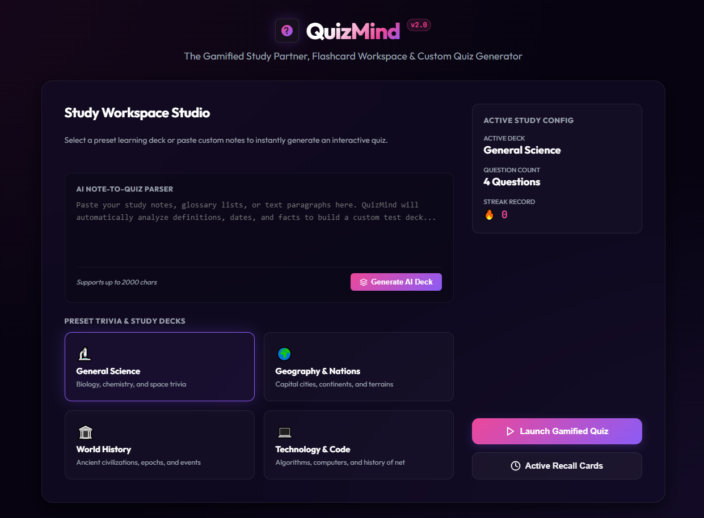
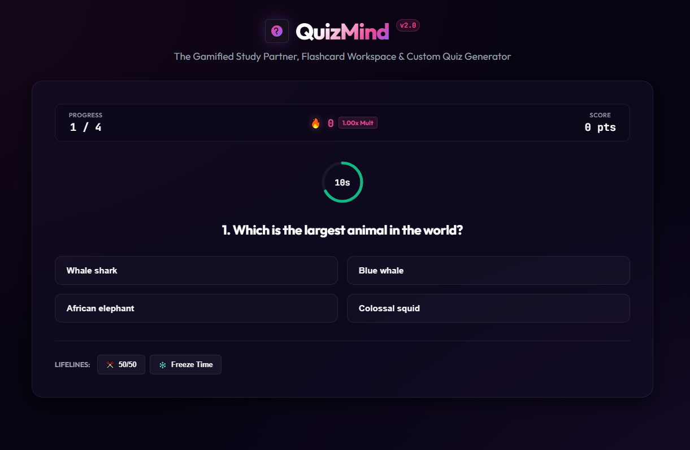
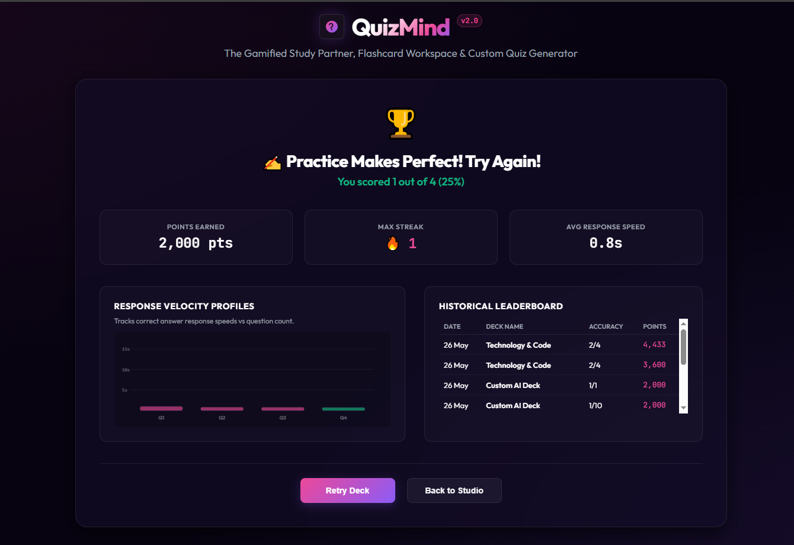

# 📚 Quiz‑Mind: AI‑Powered Study Hub



## 🚀 Overview
**Quiz‑Mind** turns raw study notes into an interactive, gamified quiz experience. Paste a paragraph of text, and the built‑in NLP engine extracts up‑to‑10 fill‑in‑the‑blank questions with smart distractors. The app features:
- ✅ Intelligent note‑to‑quiz parsing
- 🎮 Gamified scoring, streaks, and lifelines (50/50, freeze time)
- 📊 Real‑time response‑time telemetry on an HTML5 canvas
- 📈 Leaderboard with local persistence
- 📱 Responsive UI with dark mode and smooth micro‑animations

## ✨ Screenshots


| Feature | Screenshot |
|---|---|
| **Quiz Generation** |  |
| **Results Dashboard** |  |


## 🛠️ Installation
```bash
# Clone the repository
git clone https://github.com/Imtiaz-Ali17314/QuizMind-Study-Hub
cd QuizMind-Study-Hub

# No build step needed – just open the app
start index.html   # Windows
# or open index.html in your favorite browser
```
The project is a pure‑HTML/JS app; no node dependencies are required.

## ▶️ Usage
1. **Paste** your study notes into the **"Notes"** textarea.
2. Click **"Parse"** – the engine will generate up to 10 questions.
3. Choose a deck (preset or custom) and start the quiz.
4. Use lifelines to aid difficult questions.
5. Review your performance on the **Results Dashboard**.

## 🧩 Architecture Highlights
- **`extractQuestionsFromText`** – Core NLP parser that detects definition‑style triggers (e.g., *is a*, *known as*) and falls back to generic blank‑fill generation.
- **`shuffleArray`** – Fisher‑Yates implementation for unbiased answer randomisation.
- **Telemetry** – `drawCanvasVelocityChart` visualises response times with glowing emerald/pink bars.
- **LocalStorage** – Persists leaderboard and streak records across sessions.

## 🤝 Contributing
Feel free to fork the repo and submit pull requests. For major changes, open an issue first to discuss the proposed modifications.

## 📜 License
This project is licensed under the MIT License – see the `LICENSE` file for details.

---
*Built with ❤️, modern CSS, and a dash of AI magic.*
